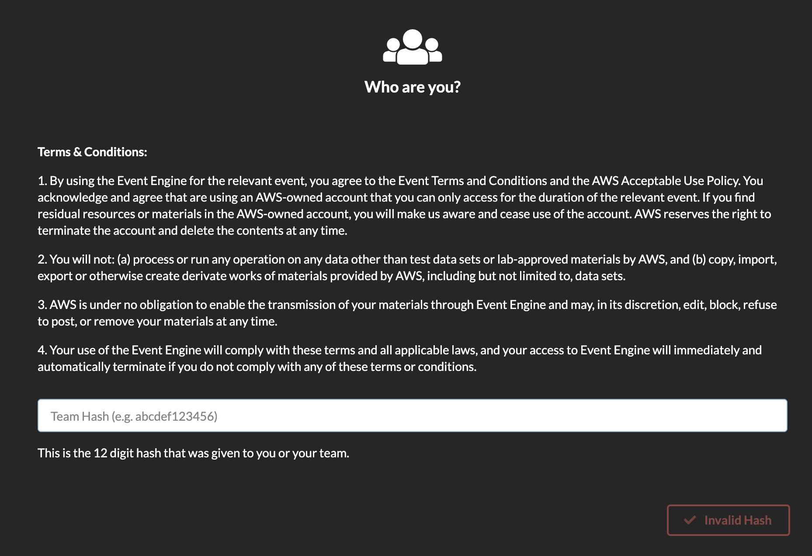

# Prerequisites

If you are running this workshop in an AWS-hosted event (i.e., there are AWS employees assisting you during these labs), then you are most likely using the official AWS platform, called Event Engine, to access temporary AWS burner accounts.

!> In order to access your AWS account, you will need a **Participant Hash**. This is a hexadecimal string (such as `abcdef123456`) that should have been provided to you by the AWS staff. If you don't have this, ask an AWS employee before moving on.

Follow these steps to access your AWS account for the day:

1. Open a web browser and head to [https://dashboard.eventengine.run](https://dashboard.eventengine.run).

	

2. Enter the provided hash in the text box. The button on the bottom right corner changes to **Accept Terms & Login**. Click on that button to continue.

	

3. Click on **AWS Console**. A pop-up will appear.

	

4. Click on **Open AWS Console**.  You will be taken to the AWS Management Console landing page.

!> **Important!** Accounts that are provided using the Event Engine platform are configured to work only on a specific region. A red message will indicate which one it is. Take note of the region and make sure that you always operate within it, as the labs might otherwise fail.

Excellent!  You can now proceed to the [Initial Setup](1-welcome/3-initial-setup.md).
