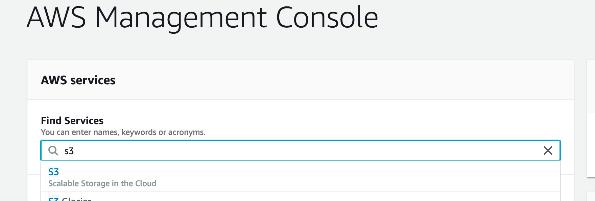
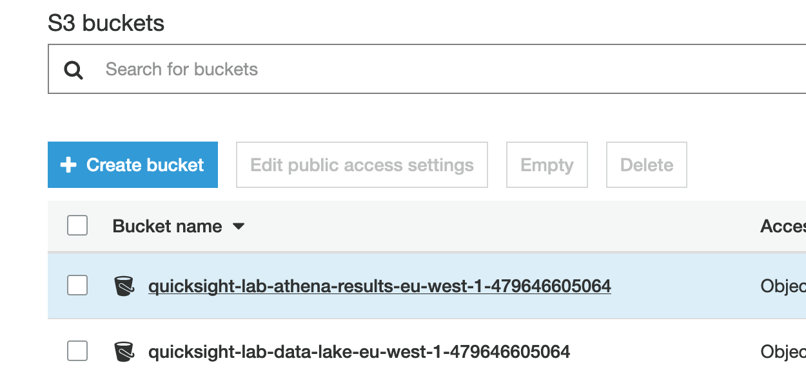
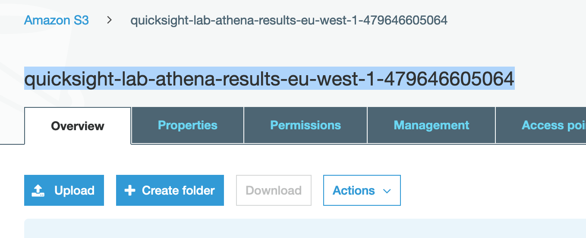
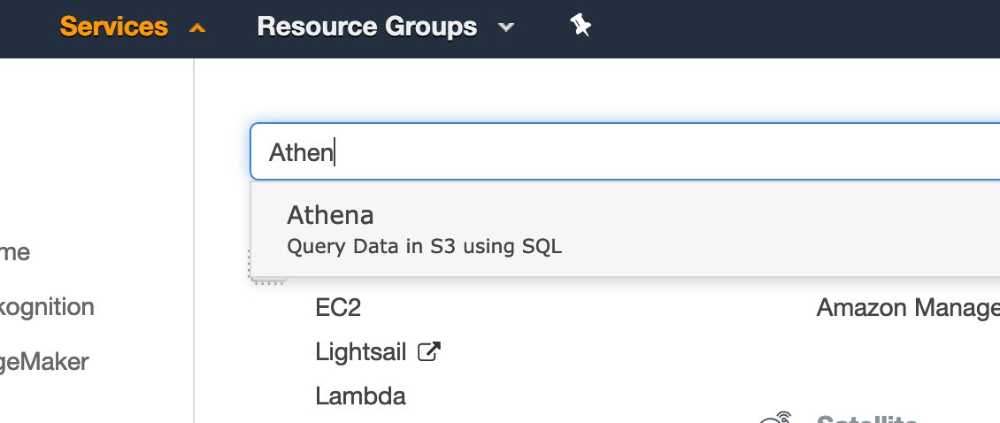
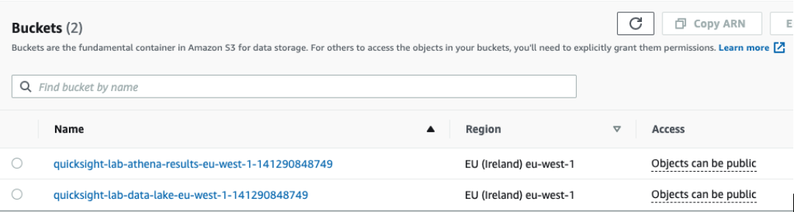
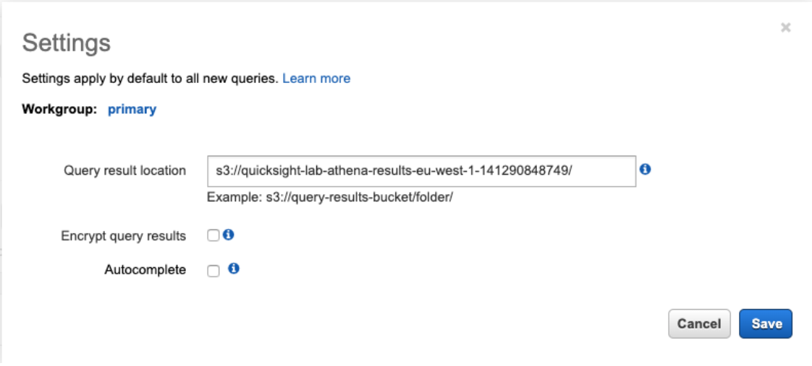

# Set up Athena

1. In the AWS services console, search for **S3**.

    

2. Select the bucket `quicksight-lab-athena-results-<region>-<account-id>`.

    

3. Copy the name from the bar on top.

    

4. From services on top type and select Athena.

    

5. If you are using Athena for the first time, click on “Get Started” button in the introduction screen.

    

6. Athena stores query results in an Amazon S3 bucket and we should configure this before we can explore our dataset. There is already a bucket created for this purpose whose name follows the pattern: `quicksight-lab-athena-results-<region>-<account-id>`. You should have it on your clipboard as per the step above.

    

7. To perform such configuration, in Athena Console, click on Settings.

    

8. Enter bucket name in the query result location field in the following format: `s3://quicksight-lab-athena-results-<region>-<account-id>/` use the name you copied from the bucket in S3 (slashes are important) and click on Save.

    
