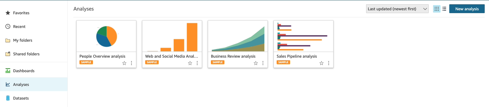

# Set up QuickSight

1.	In the AWS services console, search for QuickSight.

    

If this is the first time you have used QuickSight, you are prompted to create an account. 

2.	Click Sign up for QuickSight.

3.	For account type, please choose Enterprise Version

4.	Click Continue.

5.	On the Create your QuickSight account page, select EU (Ireland) region – Quicksight is a regional service -, accept warning if prompted and fill out your name and email address.

6.	Ensure Enable autodiscovery of data and Amazon Athena are selected.

7.	Click Choose S3 buckets and select the two available buckets.

8.	Click Finish. It will take some time for the new account to be created. Once it is done, go to the Amazon Quicksight dashboard.

9.	We are going to configure now the data set for the Quicksight analysis/dashboard that we will be building based on one of the Athena views created in the previous section. In order to do that, click Manage Data on the top right corner.

10.	Click New Data Set.

11.	On the Create a Data Set page, select Athena as the data source.

12.	For Data source name, type “ticketdata-qs" and click Validate connection.

13.	Once validated, click Create data source.

14.	In the database drop-down list, select “ticketdata” database.

15.	Choose the "sporting_event_ticket_info" table and click Select.

16.	To finish data set creation, choose the option Import to SPICE for quicker analytics and click Visualize.

SPICE is an in-memory-calculation engine that enables achieving fast performance at scale. Data is automatically replicated for high availability allowing thousands of users to simultaneously perform fast, interactive analysis while shielding your underlying data infrastructure, saving you time and resources.

This lab account has been created with a default SPICE size of 1GB. If needed, it could be increased Quicksight account settings.

You will now be taken to the QuickSight Visualize interface where you can start building your dashboard.  

Note: The SPICE dataset will take a few minutes to be built, but you can continue to create some charts on the underlying data.

