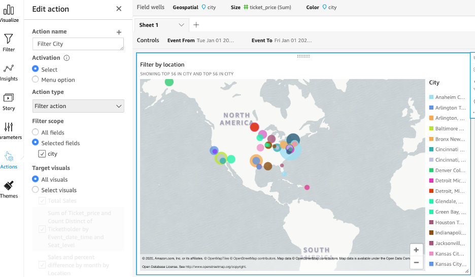
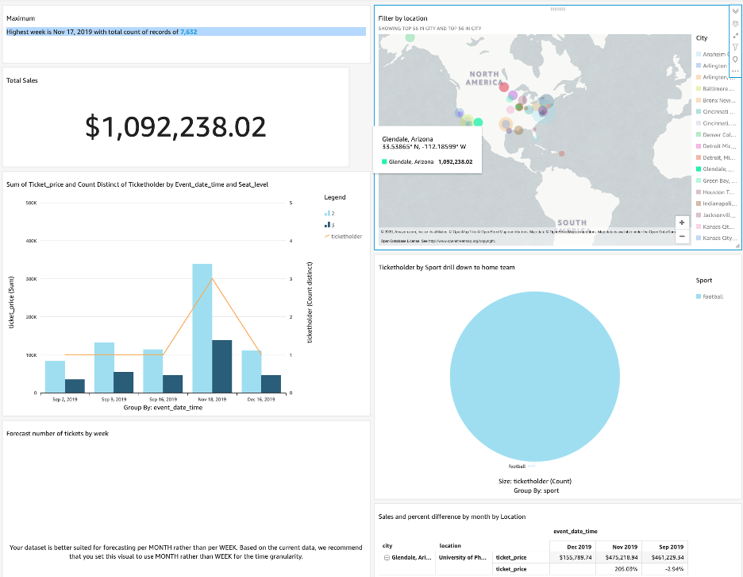

# Interactive filtering

To finish up our dashboard and make it interactive, we are going to add an action to the map we added previously so when someone selects a city, that selection is taken as a filter and applied to every other visual.

Select the MAP visual and go to Actions on the left menu. Click on Define a custom action. 

Complete the given options as follows and click on Save at the botton of the Edit Action menu:

1. Action name: “City filter”
2. Activation: “Select”
3. Action type: “Filter Action”
4. Filter scope: “Selected fields” and city
5. Target visuals: “All visuals”
 

Now when we select a city like Glendale Arizona, all the values should change to show only data for that city:

If you want to remove the filter just click anywhere on the map where there are no cities and it will display all data again.
