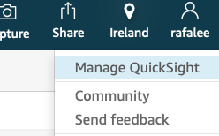
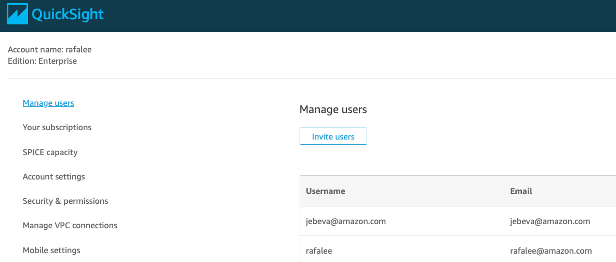
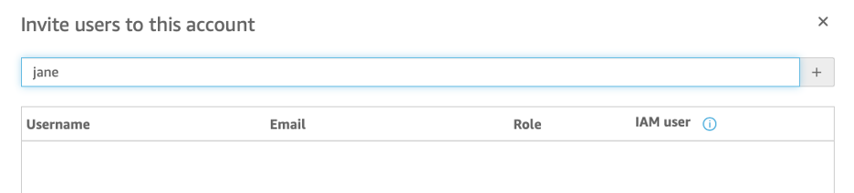
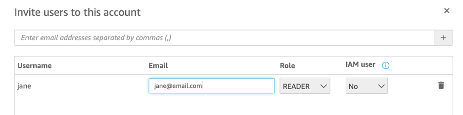
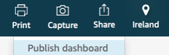
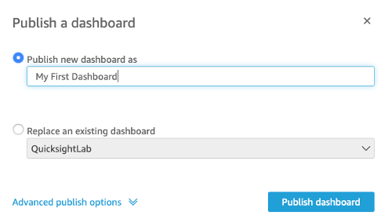
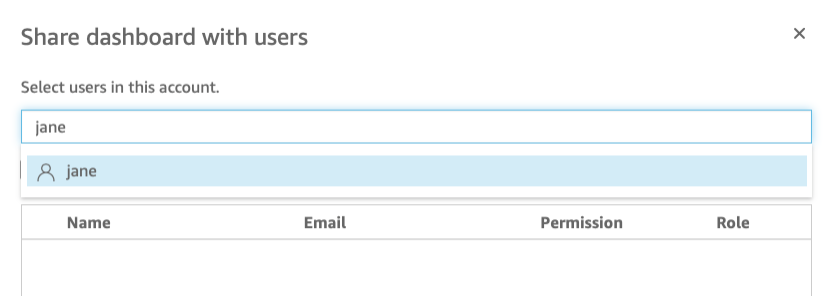
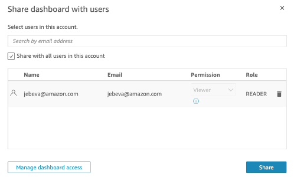
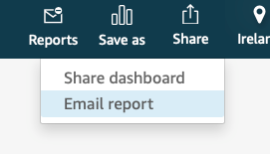
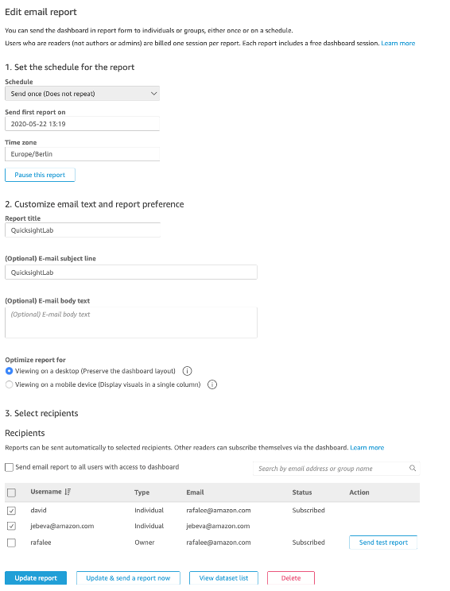

# Creating and sharing a dashboard

A dashboard is a read-only snapshot of an analysis that you can share with other Amazon QuickSight users for reporting purposes. In a dashboard, other users can still play with visuals and data but the underlying dataset is not modified.

You can share an analysis with one or more users with whom you want to collaborate on creating visuals. Analysis allows other users the ability to write and modify the data set.

Let’s create a user and share our new dashboard.

On the top right click on the user and Manage QuickSight:

Navigate now to Manage users option menu and then choose to Invite users:

Type the username of the user you would like to invite (that will be the login id) and click the plus icon on the right: 

Once added to the table below, enter email address of the user. For testing purposes, use your own email and then use on the Invite button:

That address will receive an email with an invitation to join your quicksight account and you will be able to share the dashboard with them once they sign up.

Get back to our sporting_event_ticket_info analysis. Using the Share option you can publish a dashboard. 

Enter its name and click on Publish dashboard.

Once clicked, you need to enter which users you would like to share it with. Type here the name of the user you created before and share the dashboard: 

If the user has activated his/her account, it should receive and email with a link to the dashboard.

You will be redirected to the dashboard you just shared. You also have the option to email it to audience users regularly according to different customizable settings:

**Congratulations!** You have successfully completed this lab.
