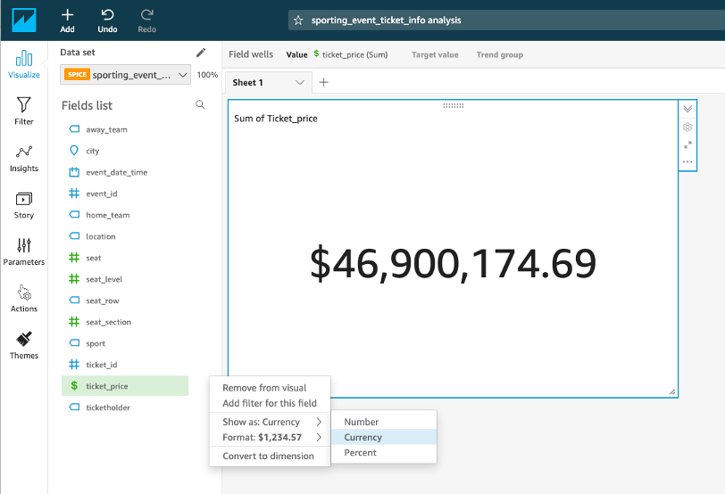
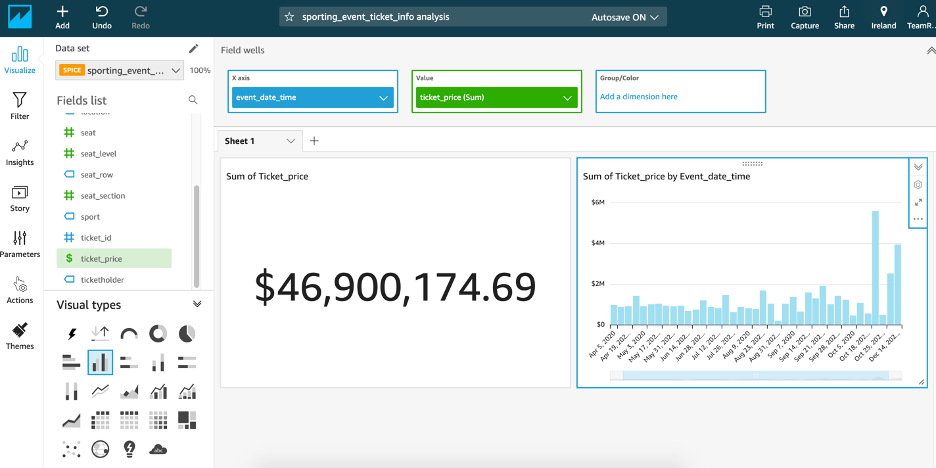
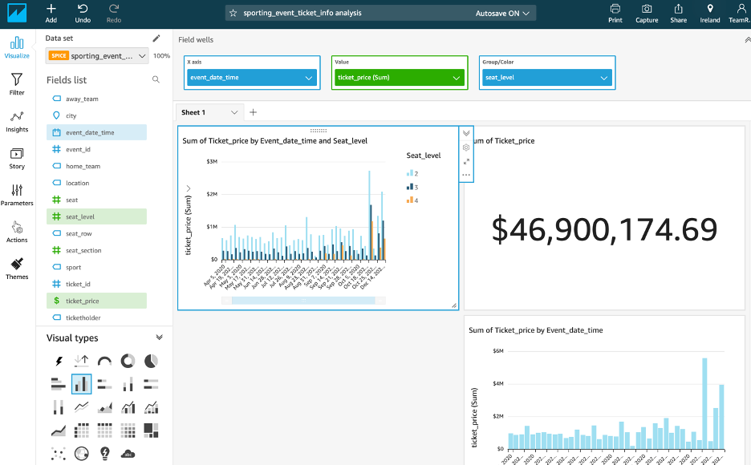
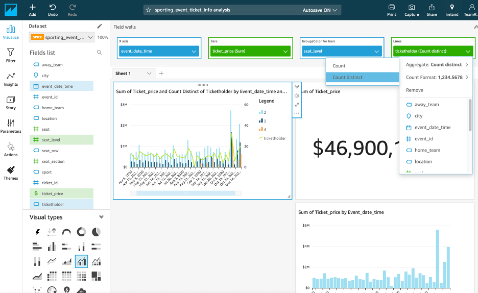
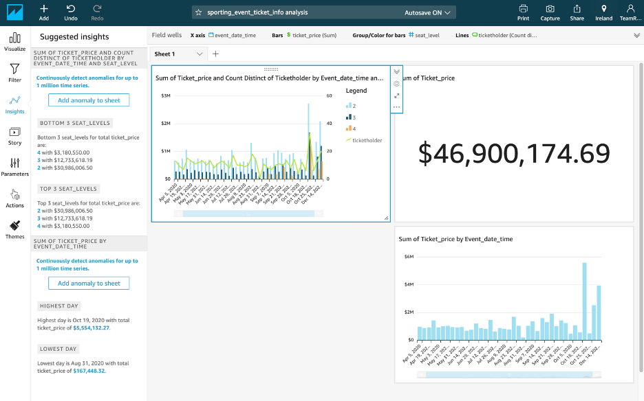

# Create QuickSight Charts

In this section we will take you through some of the different chart types.

1.	In the Fields list, click the "ticket_price" column to populate the chart.

2. Click the expand icon in corner of "ticket_price" field and select format as currency to show numbers in dollar amount. 

3.	You can add new visual and keep building your dashboard by clicking Add button at top left corner of screen. 

In the Visual types area, choose the Vertical bar chart icon. 

This layout requires a value for the X-axis. In Fields list, select the "event_date_time" field and you should see the visualization update.
For Y-axis, select “ticket_price” from the Field list.
  

4.	Add another Vertical bar chart visual with same fields for both axis. You can drag and move other visuals to adjust space in dashboard. In the Fields list, click and drag the seat_level field to the Group/Color box in the Field wells pane. You can also use the slider below the x axis to fit all of the data.
 

Let’s build on this one step further by changing the chart type to "Clustered bar combo chart" and adding in the ticketholder field for the Lines. 

5.	In the Visual types area, choose the Clustered bar combo chart icon. 

6.	In the Fields list, click and drag the ticketholder field to the Lines box in the Field wells pane. 

7.	In the Field wells pane, click the Lines box and choose Count Distinct for Aggregate. You can then see the y-axis update on the right-hand side.
 

8.	Click on insight icon on the left tabs section and explore insight information in simple English.
 

Feel free to experiment with other chart types and different fields to get a sense of the data.
