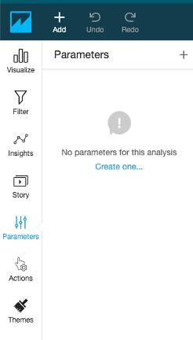
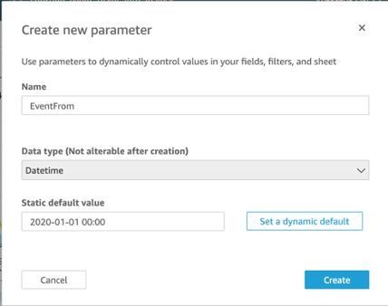
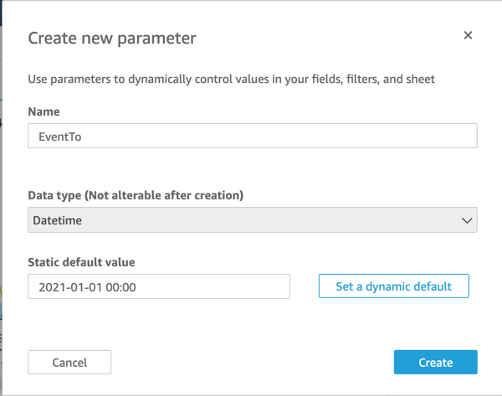
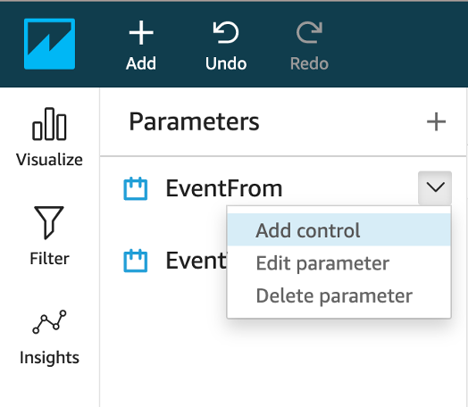
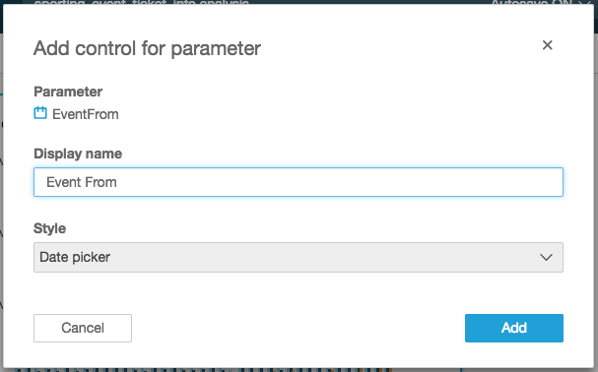
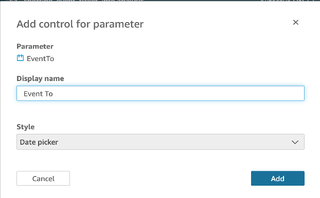
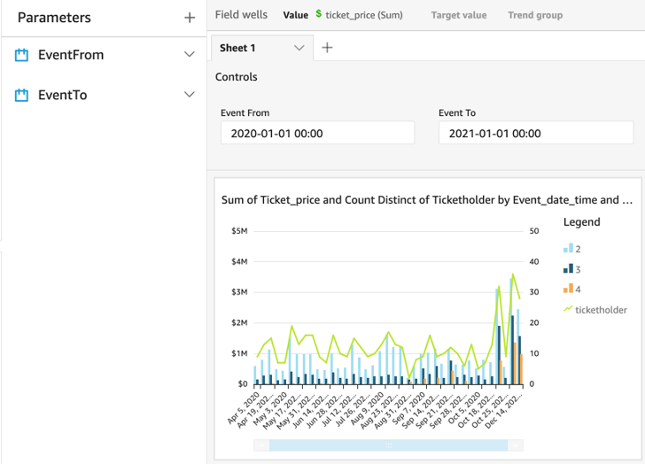

# Create QuickSight Parameters

In the next section we are going to create some parameters with controls for the dashboard, then assign these to a filter for all the visuals.

1. In the left navigation menu, select Parameters.

    

2. Click Create one to create a new parameter.

3. For Name, type EventFrom.

4. For Data type, choose Datetime.

5. For Default value, select the value - using the datepicker - as the start date available in your graph for event_date_time. For example, 2020-01-01 00:00.

6. Click Create, and then close the Parameter Added dialog box (we will be connecting it to a visual filter later).
 
    

7. Create another parameter with the following attributes:

    - Name: EventTo 
    - Data type: Datetime
    - For Default value, select the value - using the datepicker - as the end date available in your graph for event_date_time. For example, 2021-01-01 00:00.
    - Click Create
 
    

8. Click the drop-down menu for the EventFrom parameter and choose Add control.
 
    

9. For Display name, specify Event From and click Add.
 
    

10.	Repeat the process to add a control for EventTo with display name Event To.

    

    You should now be able to see and expand the Controls section above the chart.

    
