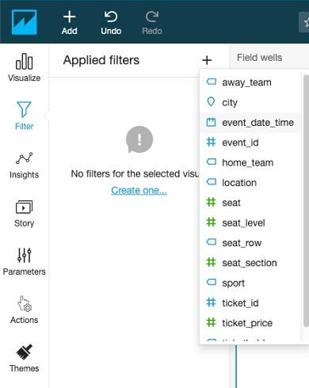
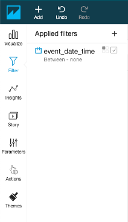
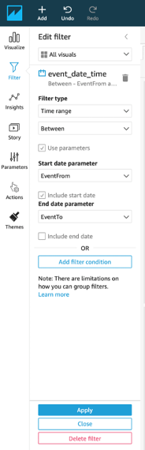

# Create a QuickSight Filter

Create a QuickSight Filter

To complete the process, we will wire up a filter to these controls for all visuals.

1.	In the left navigation menu, choose Filter.

2.	Click the plus icon (+) to add a filter for the field "event_date_time".

 

3.	Click this filter to edit the properties.

 

4.	Choose to make this filter apply to All visuals.

5.	For Filter type, choose Time range and Between. 

6.	Select option Use Parameter.

7.	For Start date parameter, choose EventFrom.

8.	For End date parameter, choose EventTo.

9.	Click Apply.

 

You can choose different date ranges for the Event Data control and see how all existing visuals update accordingly.
