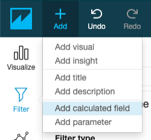
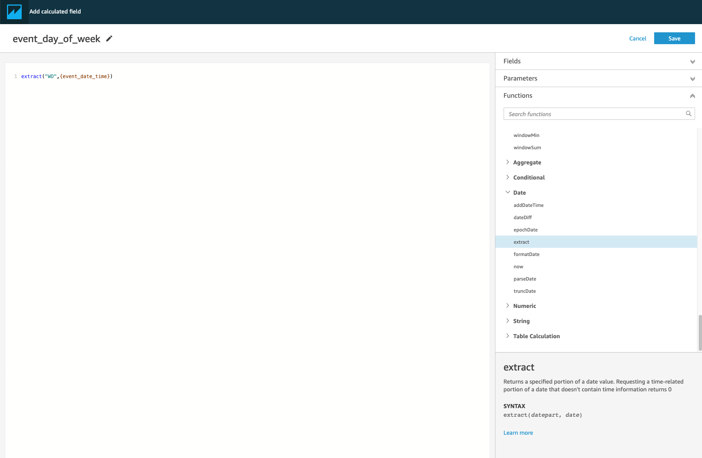
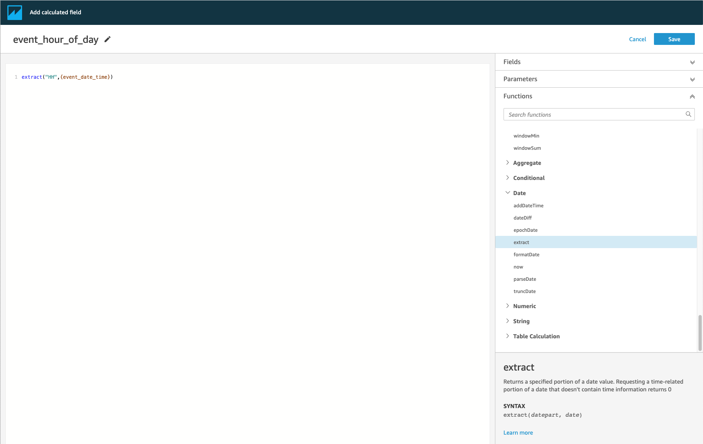
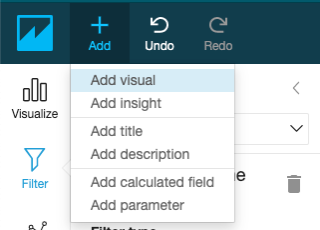
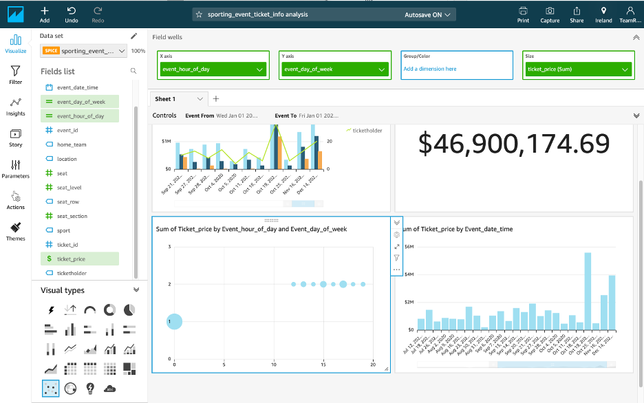

# Add Calculated Fields

Add Calculated Fields

In the next section, you will learn, how to add calculated fields for "day of week" and "hour of day" to your dataset and a new scatter plot for these two dependent variables.

1.	Click the Add button on the top left and select Add a calculated field.

 

2.	For Calculated field name type “event_day_of_week".

3.	For Formula, type extract(“WD”,{event_date_time}).
Note: extract returns a specified portion of a date value. Requesting a time-related portion of a date that doesn't contain time information returns 0. WD: This returns the day of the week as an integer, with Sunday as 1.
		
4.	Click Create.

 

5.	Add another calculated field with the following attributes:
a.	Calculated field name: "event_hour_of_day".
b.	Formula: extract("HH",{event_date_time}). 

Note: HH returns the hour portion of the date.

 

6.	Click Add button in the top left and choose Add visual.

 

7.	For field type, select the scatter plot.

8.	In the Fields list, select and drag the following attributes to the Field wells pane to set the graph attributes:
a.	X-axis: "event_hour_of_day"
b.	Y-axis: "event_day_of_week" 
c.	Size: "ticket_price"

 
