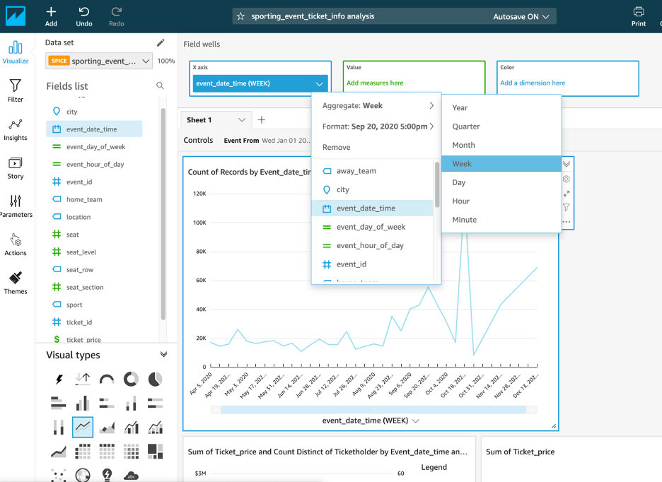
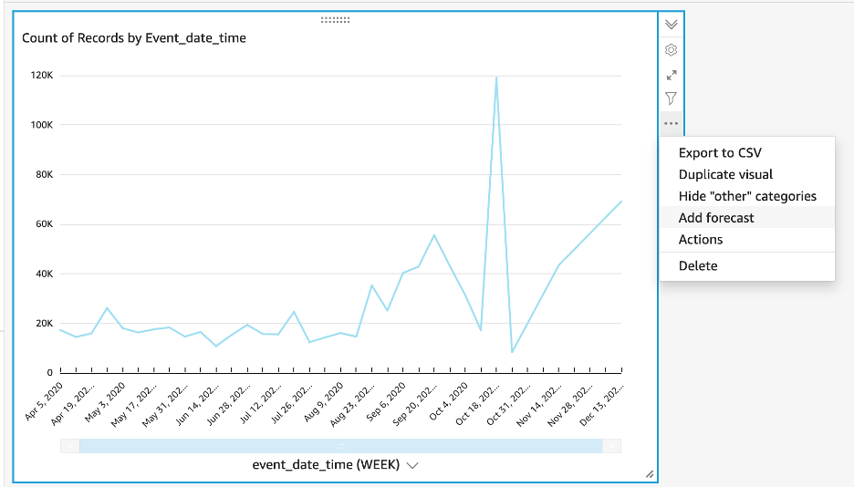
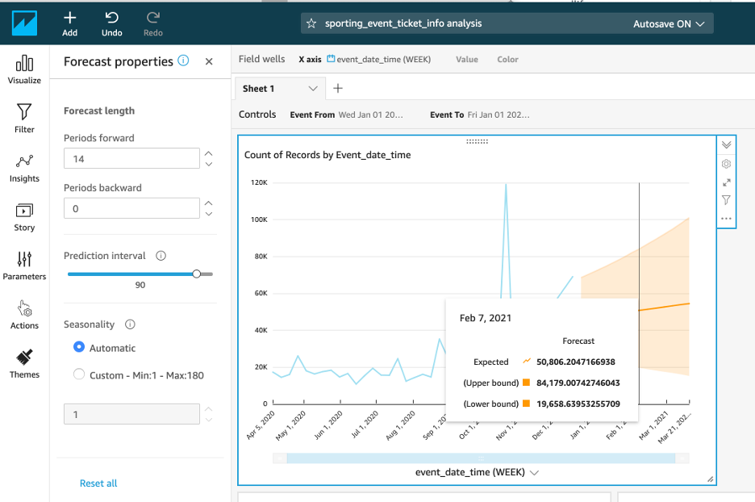
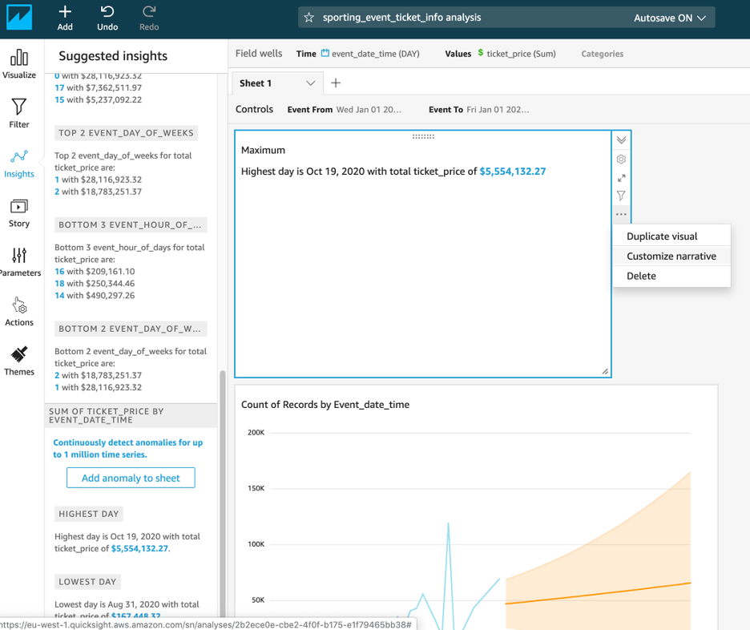
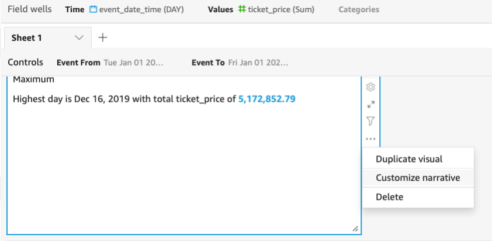

# Amazon QuickSight ML-Insights

Amazon QuickSight ML-Insights
With Amazon QuickSight, you can add Machine Learning capabilities to your visuals, easily, with one click action. There are 3 types of Machine Learning Insights:
•	Narrative 
•	Anomaly Detection
•	Forecasting 
ML-Insights is only available to enterprise version of QuickSight. If you did not select enterprise at the beginning of the lab you will need to upgrade to Enterprise Edition before you start with the task. To upgrade your Amazon QuickSight Subscription from Standard Edition to Enterprise Edition please follow this guide https://docs.aws.amazon.com/quicksight/latest/user/upgrading-subscription.html.

Let’s see how we can add a bit of forecasting in our dashboard. Forecasting works with timeseries, which is better represented with a line graph. Let’s first create a line graph. 

1.	Click Add Visual at the top left corner of screen, and select Line Chart and add the event_date_time as the x-axis and aggregate by week. As shown in below screenshot:

 

2.	Add forecasting to the visual. To do that, click on the drop-down arrow on the top right corner of the visual, and then click Add forecast. 

 

The visual will add forecast, you can hover over and explore forecasted data as shown below. Feel free to explore with the properties of the forecast algorithm. 
 

Now lets add a insight click on insights and then select the plus icon and see how it gets added to the dashboard.

 

You can go ahead and change the font and text to match what you would like it to say. Go to customize Narrative from the 3 dots … on the menu of the right of the visual and update it.

 
