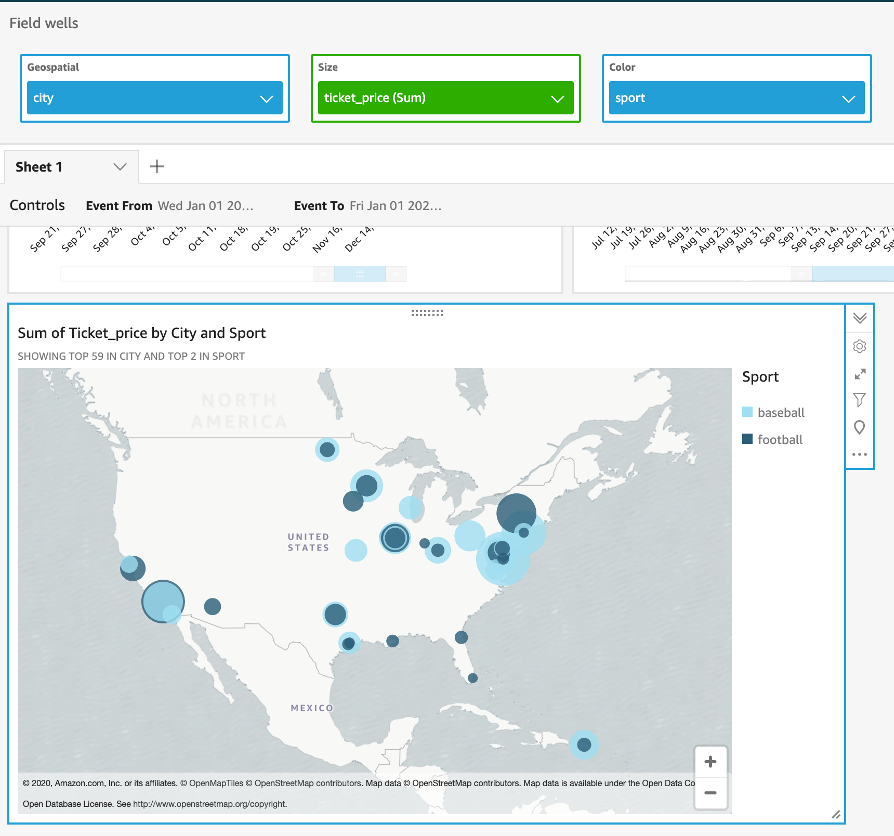

# Create a Geospatial visual

Now let’s create a map with those cities where events took place and the sum of sales of tickets for each of them.

Go to Visualize and add a new visual select the Points on Map type. Then, add city for as Geospatial field, ticket price as size and sport as color. It should display as below:

