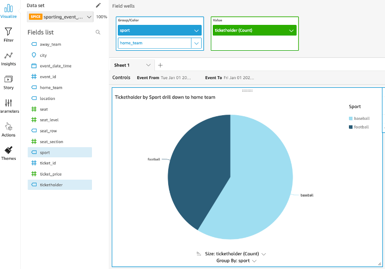
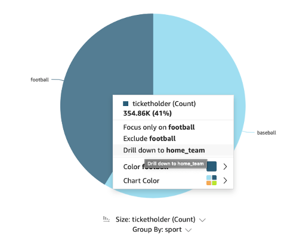
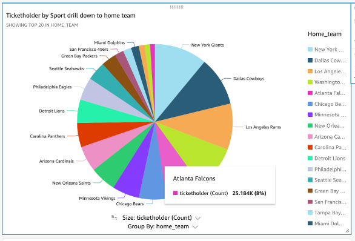

# Drill down on a Pie Chart

Let’s add a new visual and select Pie Chart Icon. Add sport to group/color and also drop home_team right below sport selection until it says “Add drill-down Layer”. Drop it should look like the one below:
 

Now when you click a sport you have the option to drill down to home_team:
 

And see the teams under that sport:
 

If you want to go back up you can click the arrow on the right of the visual menu. 
