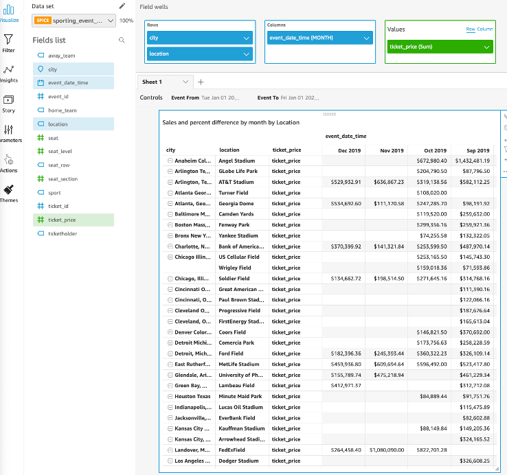
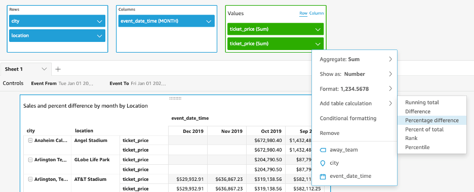
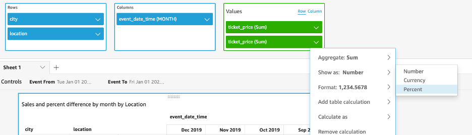
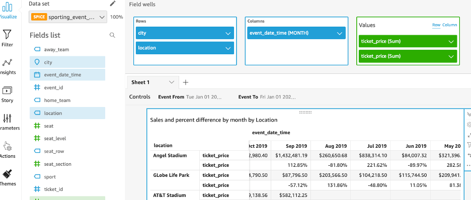
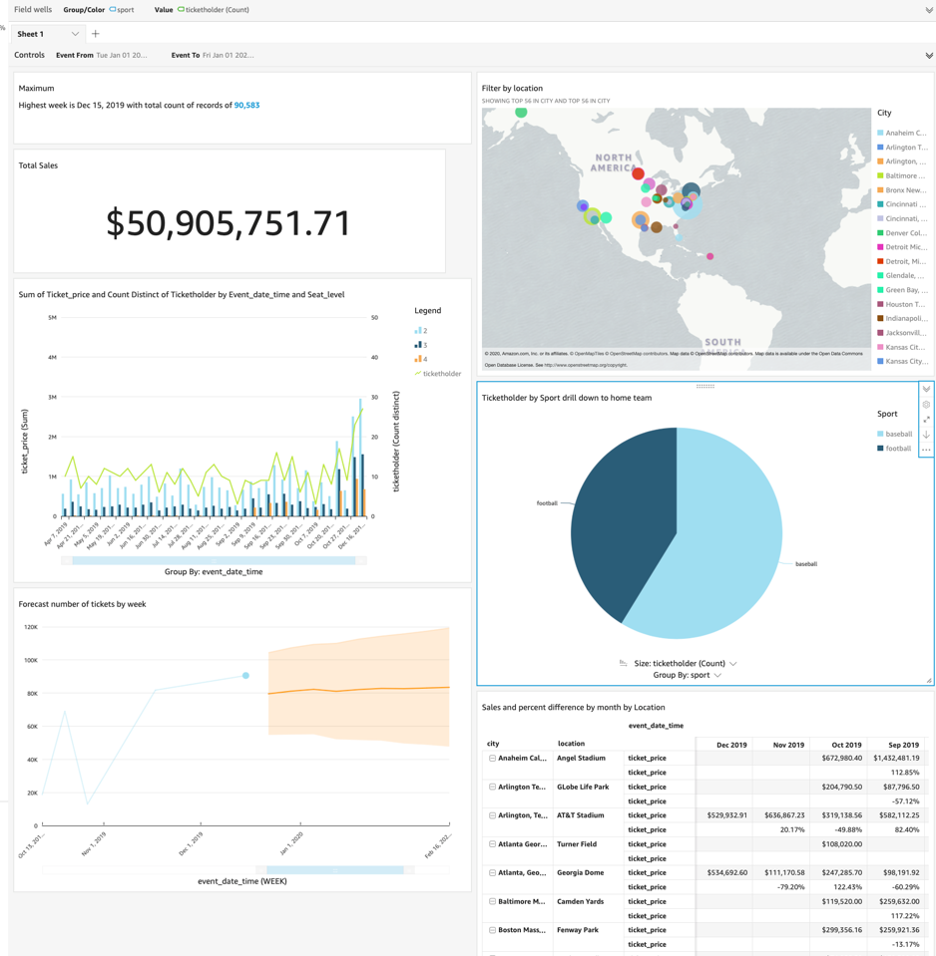

# On the fly custom metrics

Let’s see this time how easy it is to make a percent difference month to month on the tickets sold by city and team.

Add a new visual, this time it must be of the Pivot table type.

Add the city and location on the rows, then even_date_time as column (aggregated by month) and ticket_price (sum) as value (Row). It should look like this:

We can also add custom calculations to this table. In this case, we are interested in finding out how much ticket’s total price varies between months for each stadium. 

To do so, add again ticket_price(sum) as a value field well. Next, use the Percent difference for this new field by clicking in the drop-down arrow and clicking on Add table calculation, then select Percentage difference:

> [!NOTE]
> Ensure you have selected Row as the display mode for Values.

Although Quicksight should have changed new row format to be Percentage, confirm so through the Show as option:

By now, you should be able to see the percent change compared to the previous month:

Reached to this point, there is a few number of visuals in our analysis. You can re-arrange them at any time to make it look like how you want to:

