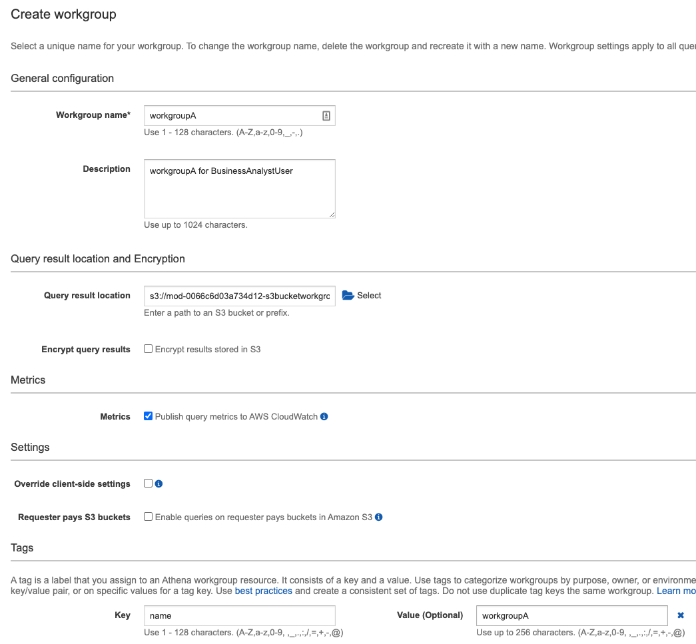
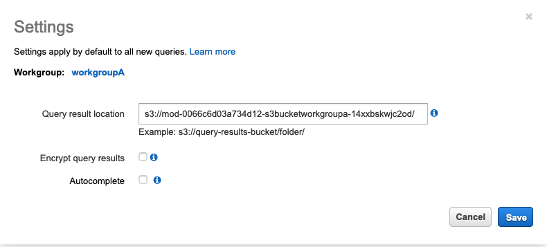

# Athena Workgroups to Control Query Access and Costs (Optional)
Use workgroups to separate users, teams, applications, or workloads, to set limits on amount of data each query or the entire workgroup can process, and to track costs. Because workgroups act as resources, you can use resource-level identity-based policies to control access to a specific workgroup. You can also view query-related metrics in Amazon CloudWatch, control costs by configuring limits on the amount of data scanned, create thresholds, and trigger actions, such as Amazon SNS, when these thresholds are breached.
Workflow setup to separate workloads

For this lab, we will create two workgroups: “workgroupA” and “workgroupB”. Before creating the workgroups, you need to have users, appropriate IAM policies to assigned to each user and S3 buckets to store the query results. This has been created using Cloud Formation template for your convenience. It is recommended to go through the template for better understanding of pre-requisites. We will have two users: “business_analyst_user” and “workgroup_manager_user” created in IAM with different policies:

	•	The business_analyst_user will have access to workgroupA and query sporting_event_info table.

	•	The workgroup_manager_user will have access to both workgroups workgroupA and workgroupB for management purposes.

The resources have been already created as part of the DMS Student lab. You can click on the CloudFormation stack and navigate to “Resources” to understand the different resources created with “DMSlab_student_CFN.json” template. Navigate to outputs section to see the results of resources created with description.

We will utilize the values from the outputs wherever required in the following steps.
Now we will create workgroups.

1.	Navigate to Athena Console and click on “Workgroup: primary”. The default workgroup provided for querying in Athena is “primary”.

2.	Click on “Create workgroup”

3.	Provide the following:

	a. Workgroup Name: “workgroupA”

	b. Description: (optional):

		i. “workgroupA for BusinessAnalystUser”

		ii. “workgroupB for workgroup manager user”

	c. Query result location: Provide the query location, You can find S3 bucket name from Cloudformation output tab of student lab

		i. For workgroupA, the s3 path would look something like: “s3:// dmslab-student-s3bucketworkgroupa-ldtj44qkwyle/”.
		
		ii. For workgroupB, provide S3 path as: “s3://dmslab-student-s3bucketworkgroupb-n2jrw40pfqcc/”.

	d. For “Encrypt query results”, leave as default i.e. unchecked. You can check this if you want your query results to be encrypted.

 	e. Check the checkbox for “Metrics: Publish query metrics to AWS CloudWatch”

4.	Provide the following:

	a. Optionally, you can click on Override client-side settings. This will override the client-side settings and keep the defaults for query execution and storing results.
	
	b. Tag your workgroup to analyze later with CloudWatch or perform any analytics on query execution and results.

		i. For workgroupA: provide key:name, value:workgroupA
	
		ii. For workgroupB: Provide key:name, value:workgroupB
	
	c. For “Requester Pays S3 buckets”, keep as default. This is Optional. Choose Enable queries on Requester Pays buckets in Amazon S3 if workgroup users will run queries on data stored in Amazon S3 buckets that are configured as Requester Pays. The account of the user running the query is charged for applicable data access and data transfer fees associated with the query.

5.	Click on “create workgroup”

6.	Follow the above procedure to create “workgroupB”.

# Explore the features of workgroups

1.	From the Outputs tab of DMS student lab, Note down user name “BusinessAnalystUser” and bucket name “S3BucketWorkgroupA” and save it.

2.	Note down 12 digit AWS account id . Follow steps here to find out account id - https://www.apn-portal.com/knowledgebase/articles/FAQ/Where-Can-I-Find-My-AWS-Account-ID

3.	Next, Open AWS console log-in different browser, select IAM user and login with following credential: 
	
	a. AccountID: 
	b. IAM User name: 
	c. Password: master123

4.	From new BusinessAnalystUser user, Navigate to Athena Console. You will notice that you can see your workgroup designated as “workgroupA” and you can also view table: sporting_event_info as shown below:

If your workgroup is other than workgroupA, click on Workgroup:

Select “workgroupA” from the workgroup list and then click on “Switch Workgroup”.

5.	If you see that your bucket is not setup with Athena to store the query results, as shown below: then proceed to setup the bucket.

6.	Setup the S3 bucket for storing the query results. Click on “Settings”.

Provide the S3 bucket location for workgroupA, copied and saved from the Output tab of cloud formation template, as shown below. Then, click on Save.

7.	Back to Athena Query Editor, click on the three dots against “sporting_event_info” view and then click on “Preview”. You will be able to see query results. This shows that you as “business_analyst_user” has access to query the view “sporting_event_info” and store the query results in S3 bucket designated for workgroupA.

8. Logged in as “business_analyst_user”, click on “workgroup” and try switching to other workgroups which this user does not have access to. Select “workgroupB” and then click on “switch workgroup”.

9. If you try running the query, you will get the error “Access Denied” as shown below:

This means that we have achieved the user segregation for different workgroups as defined by the IAM policy and attached to that user. Any query executed and its results within a particular workgroup will be isolated to that workgroup.

10.	To view the query results, navigate to “workgroup”, select the workgroup and click on “View Details”.

11.	You will be able to see the details, as shown below. Navigate to S3 bucket by clicking on the link and see the query results stored inside the “Unsaved” folder within the workgroupA bucket.

12.	Now, login as workgroup_manager_user.
	
	a. Account ID or Alias:
	
	b. IAM User Name: (for e.g: in this lab: dmslab-student-WorkgroupManagerUser-KLF9GDANNTVZ)
	
	c. Password: master123

This user has access to workgroupA and workgroupB for management purposes. Switch the workgroups to workgroupA, workgroupB and primary and you will not be able to access the primary workgroup because this user does not have access to “primary” workgroup.

Also note that this user does not have access to any tables or cannot run any queries. This is how we can isolate the responsibilities of different users within different workgroups by defining policies and attaching that to the user.

At any point of time, you can edit, delete and disable your workgroups as shown:
Select the workgroup and click on “View Details”.

Click on “Edit Workgroup” to make changes, “Delete workgroup” to delete the entire workgroup and “Disable workgroup” to disable the workgroup and disable any queries to be run within that workgroup.

Please Note: For lab purpose, we are attaching policies directly to users. For Best practices, we recommend creating separate groups in IAM for different workgroups and then attaching policies for different workgroups to their respective groups in IAM.

# Managing Query Usage and Cost

Please Note that the following section of this lab is carried out under admin account and not the BusinessAnalystUser and WorkgroupManagerUser, so please login to your account with admin credentials
Once you enable the CloudWatch metrics for your workgroups, you will be able to see Metrics, by selecting the desired workgroup and click on “Metrics” as shown:

Choose the metrics interval that Athena should use to fetch the query metrics from CloudWatch, or choose the refresh icon to refresh the displayed metrics.

Let’s setup data usage controls which means setting up the threshold for the amount of data scanned. There are two types of data usage controls: per-query and per-workgroup.

Per-query data usage control will check the total amount of data scanned by per query within the workgroup and if the amount exceeds the threshold, the query will be cancelled automatically. Let’s setup per-query data usage for “primary workgroup”.

1.	From Athena console, click on “Workgroup” and select “primary”. Click on “View Details”

2.	Click on “Data usage controls”. In “Per query data usage control”, the default minimum limit is 10MB per query. We will select the default value- 10MB. Also, note the default “Action” for per query data usage control. If the query exceeds the limit, it will be cancelled.

3.	Click “Update”

4.	The per-query threshold has been set.

5.	Navigate to query editor on Athena console. Run the following query:

SELECT * FROM "ticketdata"."cdc_sporting_event_ticket"

6.	This query scans 200 MB of data, but since we have set the threshold as 10MB, this query execution will be cancelled, as shown:

For per-workgroup data usage control, you can configure the maximum amount of data scanned by all queries in the workgroup during a specific period. This is useful when you have few analytics reports to run, where you probably have a good idea of how long the process should take and the total amount of data that queries scan during this time. You only have a few reports to run, so you can expect them to run in a few minutes, only scanning a few megabytes of data.

1.	Login as Admin to the account. On Athena console, click on “Workgroup” and Select “workgroupA”. Click on “View Details”.

2.	Click on “Data usage Controls” and scroll down to section “Workgroup data usage controls”. Click on “Create workgroup data usage control”

3.	The select query on “sporting_event_info” returns more than 10KB of data. For this lab, we have only this table to query from. So, let’s set the threshold accordingly.
	
	a. Set “Data Limits” to 10 KBs
	
	b. Set “Time period” to 1 minute
	
	c. Set “Action” as “Send a notification to”. Here, click on “Create SNS Topic”.

		i. This will take you to SNS Console. Provide Topic Name as “workgroupA”.

		
		ii. Click on “Next Step”
		
		iii. Click on “Create Subscription”. We will subscribe to this topic with email address. Whenever the threshold is breached, we will get an email notification to the email address which is our subscriber.

		iv. In Create Subscription, select “Protocol” as Email. In “Endpoint”, Provide email address. Then click on “Create subscription”.

		v. Verify your email for subscription to be validated.
		
		vi. Back to WorkgroupA workgroup data usage control, for “Action”, select “workgroupA” for the SNS topic. Click on “Create”.

		vii. Once created, this control will be listed like this:

4.	Back to Athena Query Editor, run the following query, by logging in as Business Analyst User to the console and selecting “Workgroup: workgroupA”:

SELECT * FROM "ticketdata"."sporting_event_info";

5.	You will receive an email notification from AWS Notifications stating that workgroup data usage threshold has been breached, which will look something like this:

6.	You can also check CloudWatch Alarms and get more details on CloudWatch console:

7.	Alternatively, you can have AWS Lambda as the subscriber endpoint, so as soon as the threshold is breached, SNS will call the lambda function, which in turn will disable the workgroup and preventing from executing further queries within that workgroup. Feel free to explore multiple subscriber endpoints.

# Cost Allocation Tags

When you created two workgroups: workgroupA and workgroupB, you also created name as tags. These tags can be utilized in Billing and Cost Management console to determine the usage per workgroup. Learn more about tags.

For example, you can create a set of tags for workgroups in your account that helps you track workgroup owners, or identify workgroups by their purpose. You can view tags for a workgroup in “View Details” page for the workgroup under consideration.
You can add tags later after you have created workgroup. To create tags:

1.	Open the Athena console at https://console.aws.amazon.com/athena/, choose the Workgroups tab, and select the workgroup.

2.	Choose View details or Edit workgroup.

3.	Choose the Tags tab.

4.	On the Tags tab, choose Manage tags, and then specify the key and value for each tag.

5.	When you are done, choose Save.

For more details on best practices: https://docs.aws.amazon.com/athena/latest/ug/tags-console

